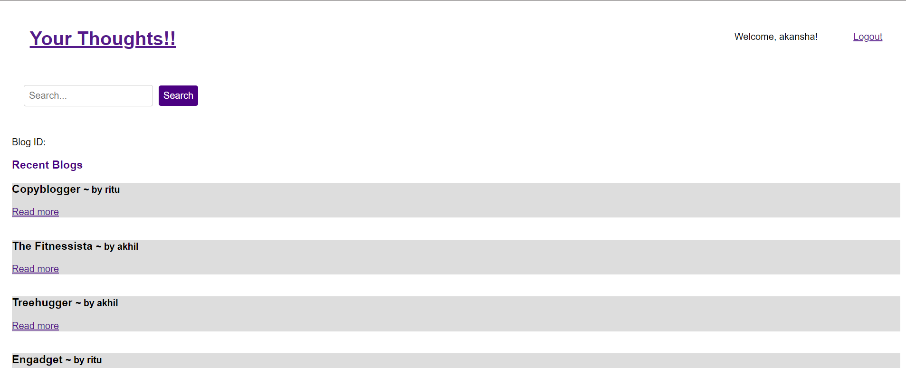
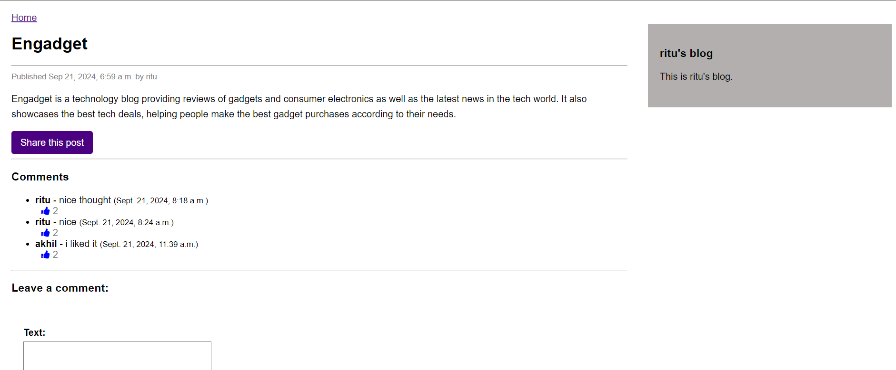
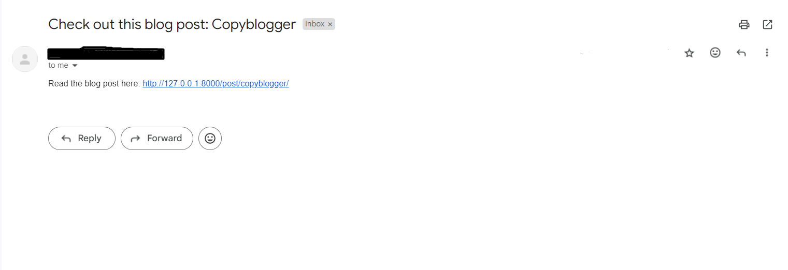

# Django based blog application

### Website Preview
#### Home Page



#### Blog Page


#### Successfully Mail send Page 


----

### Clone

- Clone this repo to your local machine.

### Create or Run a Virtual Environment

```shell
$ python -m venv env
$ .\env\scripts\activate
```

#### Note

- Before running the project make sure you are in project directory where manage.py file present if not then enter
  >cd blog

## Installation 📦

>pip install -r requirements.txt


### Run server locally

```shell
$ python manage.py makemigrations
$ python manage.py migrate
$ python manage.py runserver
```
> [Go to localhost:8000](http://127.0.0.1:8000/)

---

## Features 📋


### User Authentication
- **Login:**
  - Users can log in with their email.
  - Email is case insensitive.
- **Signup:**
  - Users can sign up using their email only.

### Blog Management
   - Admin interface for creating, updating, and deleting blog posts.

### List and Detail Views
   - View a list of blogs with pagination (5 blogs per page).
   - View details of each blog.

### Tagging
   - Add tags to blogs and filter/search by tags.

### Comment System
   - Users can comment on blogs.
   - Users can like comments.

### Email Sharing
   - Share blog posts through email.

---

